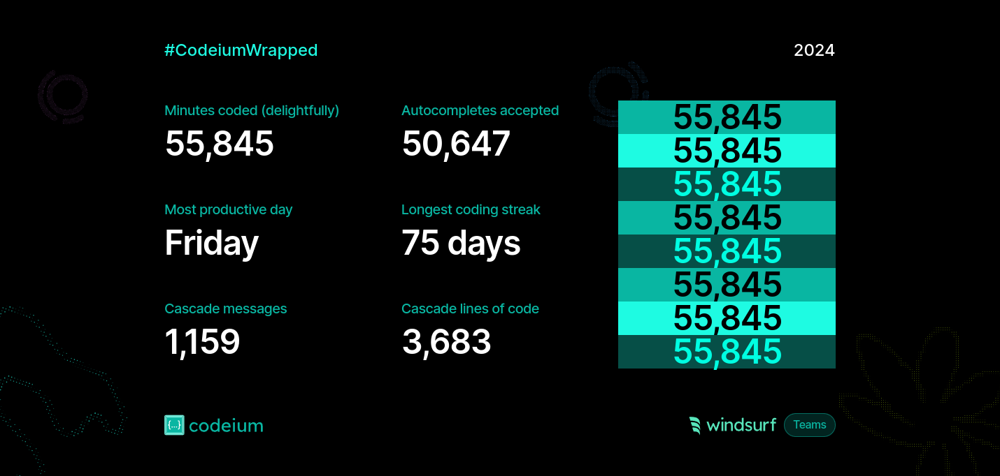
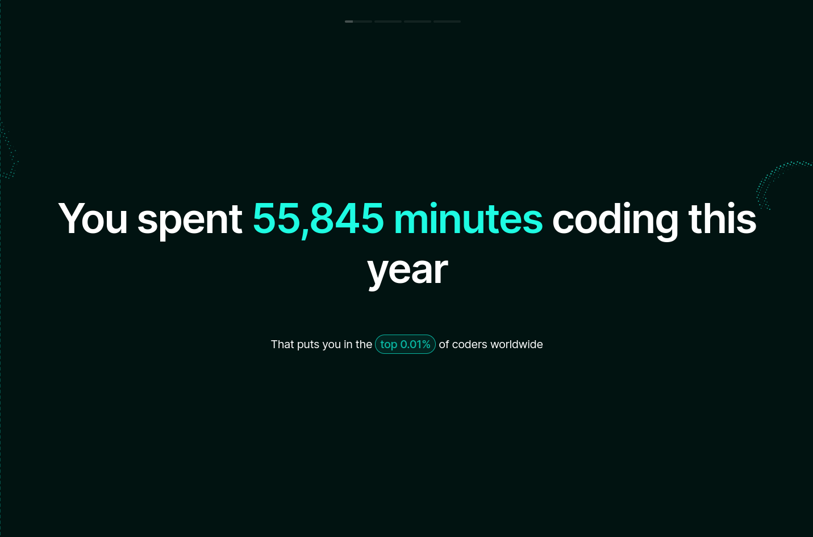

# Viky's Development Portfolio

## About Me

I'm a Full-stack Developer who loves exploring technologies and solving problems. Through my journey, I've come to appreciate these principles:

- **Type Safety**: Preventing bugs through strong typing across languages
- **Simplicity**: Clean, flat structures that are easy to understand
- **Explicitness**: Clear, intentional code over implicit magic
- **Modularity**: Independent, composable pieces that work together
- **Extensibility**: Flexible patterns that grow with your needs

## Tech Stack 🛠️

### Languages

### Frontend

### Backend

### Tools & Build Systems

### Styling

## Quick Links 🔗

- 🌐 [Portfolio](http://personal-portfolio-eight-rose.vercel.app/)
- 📚 [Digital Garden](https://digital-garden-vikyw89.vercel.app)
- 📧 [vikyw89@gmail.com](mailto:vikyw89@gmail.com)

## Let's Connect 🤝

I'm always open to collaborating on interesting projects that push the boundaries of technology and solve real-world problems. Feel free to reach out if you have an exciting project in mind!

### Socials

    

### Badges

### Support Me

