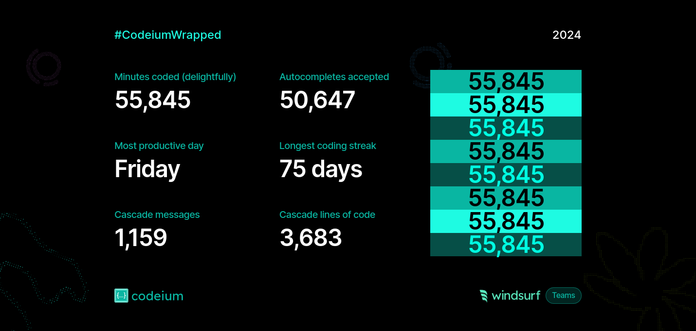
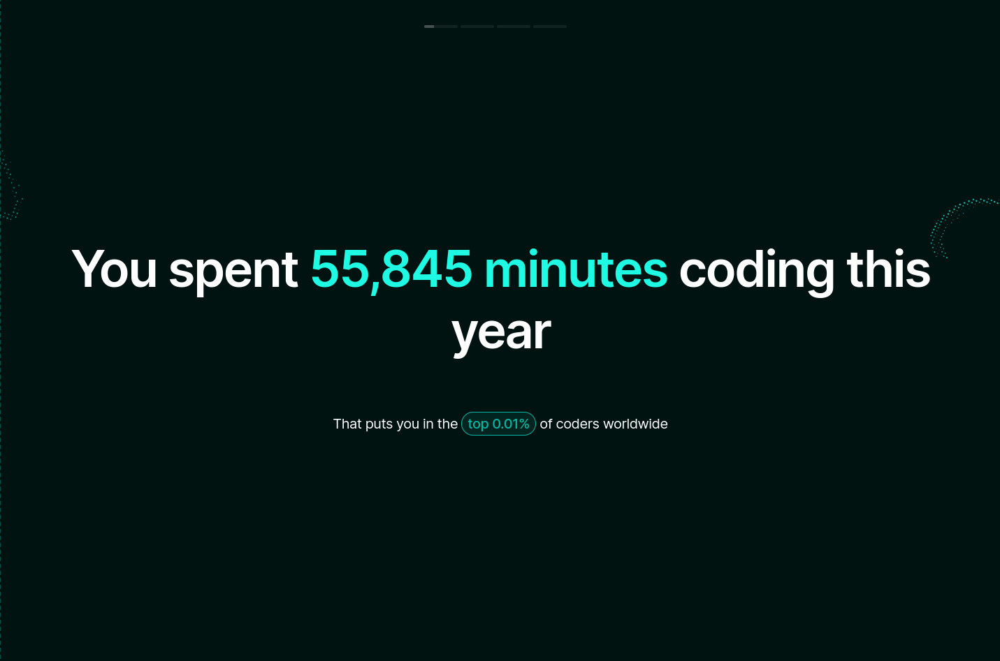

# Viky's Development Portfolio

## About Me

I'm a Full-stack Developer who loves exploring technologies and solving problems.

## Tech Stack 🛠️

### Languages

### Frontend

### Backend

### Tools & Build Systems

### Styling

## Quick Links 🔗

- 🌐 [Portfolio](http://personal-portfolio-eight-rose.vercel.app/)
- 📚 [Digital Garden](https://digital-garden-vikyw89.vercel.app)
- 📧 [vikyw89@gmail.com](mailto:vikyw89@gmail.com)

## Let's Connect 🤝

I'm always open to collaborating on interesting projects that push the boundaries of technology and solve real-world problems. Feel free to reach out if you have an exciting project in mind!

### Socials

    

### Badges

### Support Me

